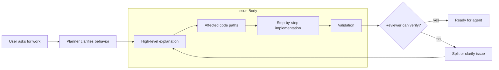
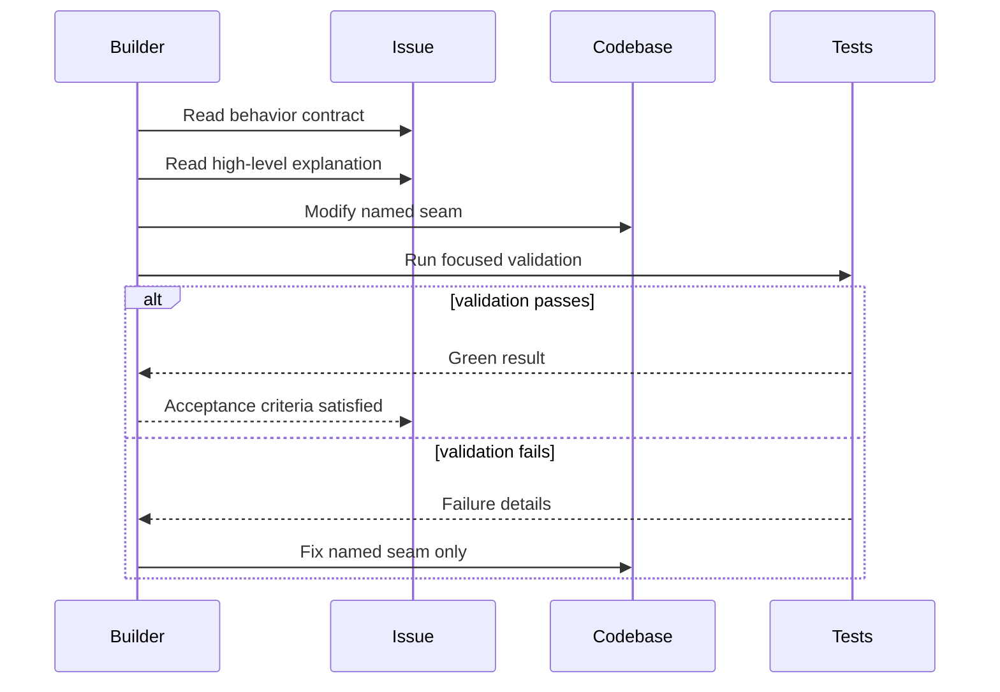
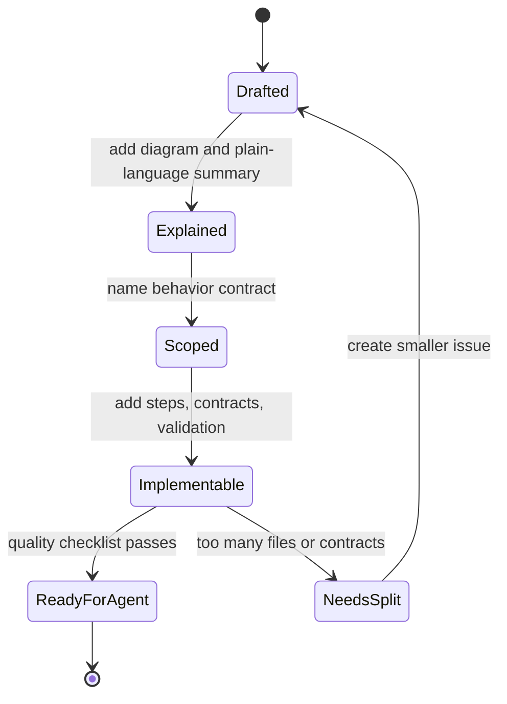
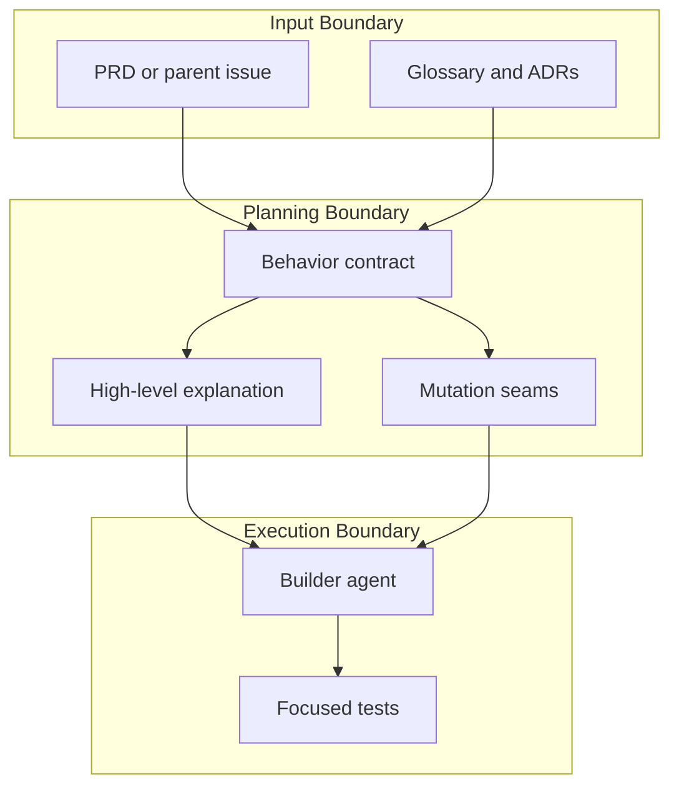
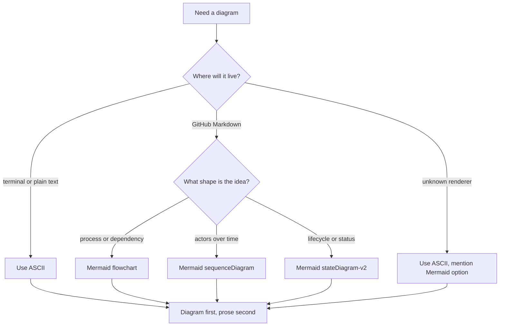

# Mermaid Diagram Examples

Use Mermaid when the target Markdown renderer supports it, especially GitHub issues, GitHub PRs, README files, and docs sites. Keep diagrams renderer-friendly: short labels, common Mermaid primitives, explicit boundaries, and enough structure to teach without prose.

## 1. Flowchart With Boundaries

Use for process flow, architecture ownership, or handoffs between systems.

This shape works when readers need to see where one artifact or system owns each part of the flow.

## 2. Sequence Diagram

Use for request/response, actor interaction, retries, or external calls over time.

This shape works when order and responsibility matter more than static structure.

## 3. State Diagram

Use for lifecycle, queue state, status labels, verdicts, or anything where transitions are the concept.

This shape works when the main question is "what states exist, and what changes them?"

## 4. Architecture Boundary

Use for modules, ownership, dependencies, and data crossing boundaries.

This shape works when the explanation needs to separate "what defines the work" from "who executes it."

## 5. Decision Matrix As Flow

Use when a reader needs to understand how branches are chosen.

This shape works when the explanation itself is about choosing between options.
