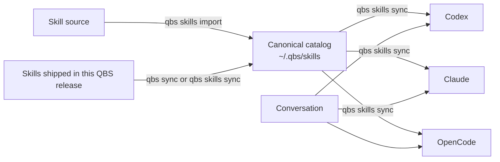

<div align="center">

# QBS

### A calm, local-first foundation for AI-assisted workspaces

QBS prepares a repository for AI work and keeps one curated skill catalog in
sync across the tools you use.

<p>
  <a href="https://github.com/apourman/qbs/releases"></a>
  <a href="https://github.com/apourman/qbs/actions/workflows/release.yml"></a>
</p>



</div>

## Why QBS?

AI tools are most useful when they share the same vocabulary, instructions,
research notes, and reusable workflows. QBS gives those pieces a predictable
home without taking ownership of your project files or sending local triage
work to a hosted service.

| Need | QBS provides |
| --- | --- |
| Start a repository | `qbs init` creates local AI workspace structure and guidance. |
| Reuse skills and agents | `qbs sync` installs curated skills and generated agents globally for Codex, Claude, and OpenCode. |
| Keep context local | Research, specifications, triage records, and domain context stay in the workspace. |
| Stay predictable | Existing files are preserved, generated copies are marked, and hosted projection is opt-in. |

## Quick start

### 1. Install QBS

With Go installed:

```sh
go install github.com/trues/qbs/cmd/qbs@latest
```

Or download a release archive from [GitHub Releases](https://github.com/apourman/qbs/releases).

Check the installation:

```sh
qbs --version
```

### 2. Prepare a repository

From the repository you want to work in:

```sh
qbs init
```

QBS creates the local structure for research, specifications, and engineering
guidance. It also configures shared Git excludes so private workspace context
does not get committed accidentally.

### 3. Add curated skills

Import one skill or a directory of skills:

```sh
qbs skills import /path/to/skill
qbs skills import /path/to/skill-collection
```

QBS keeps the canonical catalog at `~/.qbs/skills/` and synchronizes managed
copies to the global discovery locations for Codex, Claude, and OpenCode.
Each QBS release ships the skills tracked in its repository. `qbs sync` and
`qbs skills sync` refresh those built-in skills in the canonical catalog, sync
them to each harness, and preserve separately imported skills. `qbs sync` also
installs QBS's built-in agents.
Separately imported skills take precedence when their names match bundled
skills.

## The skill lifecycle



Managed copies are normalized for conversation-first use: QBS removes the
`disable-model-invocation` frontmatter setting while importing or syncing a
skill. The original source directory is not changed.

## Everyday commands

| Command | What it does |
| --- | --- |
| `qbs init` | Prepare the current Git repository for local AI work. |
| `qbs sync` | Refresh skills shipped with this release, sync cataloged skills, and install generated agents and shared instructions globally. |
| `qbs skills import <path>` | Add a skill or collection to the catalog and sync it. |
| `qbs skills list` | Show the catalog and configured global targets. |
| `qbs skills sync` | Refresh release skills and re-sync every cataloged skill. |
| `qbs skills remove <name>` | Remove a cataloged skill and its managed copies. |
| `qbs update` | Update an installed QBS release on supported platforms. |

Use `qbs skills import <path> --force` when you intentionally want to replace
an existing catalog entry. QBS will not silently replace an unmanaged skill at
a destination.

## What `qbs init` creates

Initialization is deliberately small:

```text
your-repository/
├── docs/agents/       # local engineering guidance
├── .artifacts/        # local HTML pages
├── .research/         # local research notes
└── .specs/            # local specifications and tickets
```

Shared agent instructions are global, not per repository. `qbs sync` writes
them to `~/.claude/rules/qbs.md` for Claude and to a marked QBS block in
`~/.codex/AGENTS.md` (or `$CODEX_HOME/AGENTS.md`) and
`~/.config/opencode/AGENTS.md`, leaving the rest of those files untouched. A
repository's own `AGENTS.md` and `CLAUDE.md` are left to its owners; `qbs init`
removes only unedited copies that older QBS versions generated, along with
their Git excludes.

Curated skills remain global. QBS does not create or modify project-local
harness skill directories during initialization.

## Configuration

QBS works out of the box, but these environment variables are useful when a
machine has non-standard locations:

| Variable | Purpose |
| --- | --- |
| `QBS_HOME` | Move the canonical catalog from `~/.qbs/`. |
| `QBS_SKILL_TARGETS` | Provide an OS-specific path list of global skill targets. |
| `QBS_UPDATE_BRANCH` | Tell the local update hook which branch to watch. |

## Build from source

QBS is a small Go program with no runtime dependencies beyond Git for project
commands.

```sh
git clone https://github.com/apourman/qbs.git
cd qbs
make test
make build
./qbs --version
```

For local release artifacts and an end-to-end smoke test:

```sh
make release-artifacts
make smoke-release
```

See [INSTALL.md](INSTALL.md) for release installation, local installation,
updates, and platform details. See [CONTRIBUTING.md](CONTRIBUTING.md) for
commit and release conventions.

## Design principles

- **Local first.** Workspace records are authoritative on disk.
- **Global skills, local context.** Reusable skills travel with the user;
  project-specific context stays with the project.
- **Explicit ownership.** QBS marks managed copies and protects unmanaged
  files.
- **Boring operations.** Initialization is safe to repeat, and synchronization
  is deterministic.
- **Small surface area.** A few commands should cover the common path.
